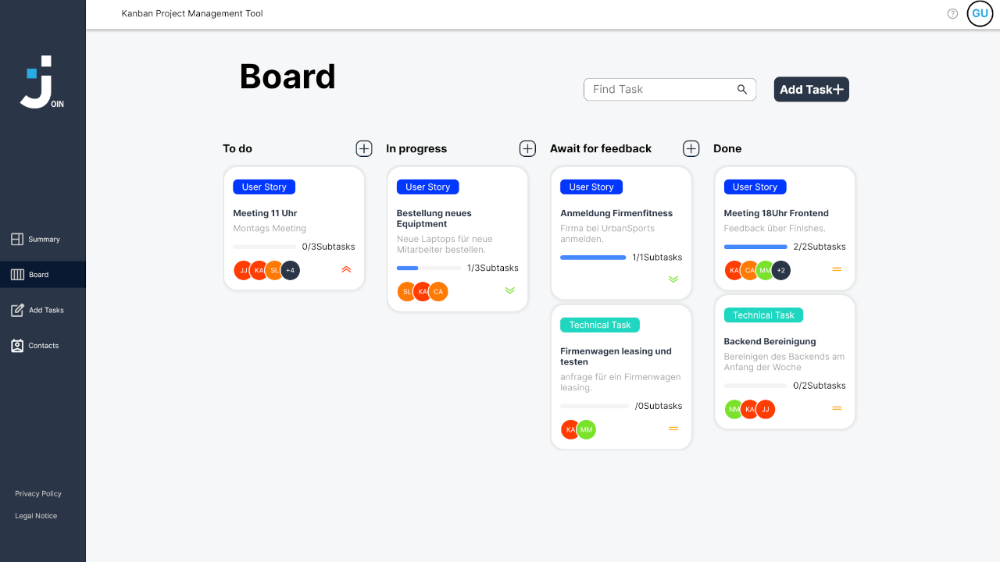

# 📋 Join - Collaborative Task Management 

A Kanban-style productivity tool with contact management, drag & drop tasks, and responsive multi-page architecture. Built with vanilla JavaScript following clean code principles.

---

## 🌐 Live Demo

🔗 [Live Demo – join.dev2k.org](https://join.dev2k.org/)

---

## 🖥️ Preview



---

## ✨ Key Features

**Core Functionality:**
- 📋 Kanban board with 4 status columns (ToDo, In Progress, etc.)
- 👥 Shared workspace for all users (including guest login)
- 📱 Full responsive design (320px+ support)
- 🔍 Real-time task search
- 📅 Dashboard with task statistics
- 🎯 Drag & drop task management (desktop + mobile)
- 📝 Form validation & instant feedback
- 📞 Contact management with CRUD operations
- 📜 Legal notice & privacy policy documentation

**Technical Highlights:**
- 🧩 Multi-Page Application (MPA) architecture
- 📂 Structured JS/CSS file organization
- ✨ Clean code principles (JSDoc, max 400 LOC/file)
- 🛠️ Cross-browser compatibility
- 📱 Mobile-first approach
- 🔄 Real-time updates without page reload
- 📦 Local storage integration

---

## 🛠️ Tech Stack

- **MPA Architecture** with cross-page logic
- **Modular JavaScript** with clear separation of concerns
- **Responsive design** with mobile optimization
- **Cross-browser testing** (Chrome, Firefox, Safari, Edge)
- **GitHub best practices** (meaningful commits, .gitignore)

---

## 🚀 Installation

1. Clone repository:
   ```text
   git clone https://github.com/KosMaster87/Join
   ```

2. Open in browser:
   ```text
   cd Join && open index.html
   ```

---

## 📁 Folder Structure

```text
join/
├── assets/
│   ├── fonts/          # Inter font variants
│   ├── img/            # SVG icons & UI elements
│   │   ├── addContact/
│   │   ├── add_task/
│   │   ├── board/
│   │   └── ...        
│   └── templates/      # HTML partials
│       ├── header.html
│       └── menu.html
│
├── css/
│   ├── addTask.css
│   ├── board.css
│   ├── contact/
│   └── ...             # Page-specific styles
│
├── js/
│   ├── board/          # Kanban logic
│   │   ├── boardDragSearch.js
│   │   └── boardEdit.js
│   ├── contact/        # Contact management
│   ├── header.js
│   └── ...             # Page logic
│
├── pages/              # HTML views
│   ├── addTask.html
│   ├── board.html
│   └── contacts.html
│
├── index.html          # Entry point
└── style.css           # Global styles
```

---

## 📁 Next Stuff


   
