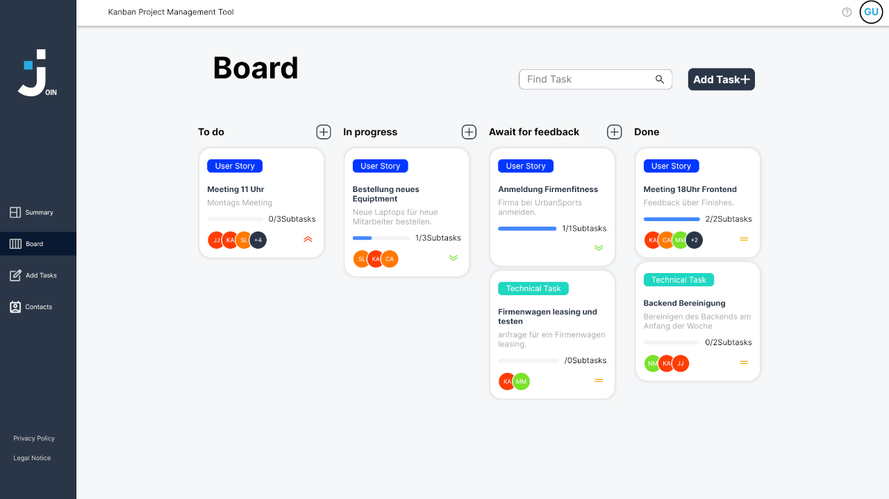

# 📋 Join - Collaborative Task Management

A Kanban-style productivity tool with contact management, drag & drop tasks, and responsive multi-page architecture. Built with vanilla JavaScript and Firebase Firestore following clean code principles.

---

## 🌐 Live Demo

🔗 [Live Demo – join.dev2k.org](https://join.dev2k.org/)

---

## 🖥️ Preview



---

## ✨ Key Features

**Core Functionality:**

- 📋 Kanban board with 4 status columns (ToDo, In Progress, Await Feedback, Done)
- 👥 Shared workspace with Firebase authentication (email/password + guest login)
- 📱 Full responsive design (320px+ mobile-first support)
- 🔍 Real-time task search and filtering
- 📅 Dashboard with task statistics and summaries
- 🎯 Drag & drop task management (desktop + mobile touch support)
- 📝 Advanced form validation with instant feedback
- 👤 Contact management with full CRUD operations
- 📜 Legal notice & privacy policy pages
- 🔐 User authentication with Firebase Auth
- ☁️ Cloud data persistence with Firestore

**Technical Highlights:**

- 🧩 Multi-Page Application (MPA) architecture
- 📂 Modular file structure with core/ subdirectories
- ✨ Clean code principles (JSDoc documentation, max 400 LOC/file)
- 🔥 Firebase integration (Auth + Firestore)
- 📱 Mobile-first responsive approach
- 📦 Service-based architecture for data management

---

## 🛠️ Tech Stack

- **Frontend:** Vanilla JavaScript (ES6+), HTML5, CSS3
- **Backend:** Firebase Firestore (NoSQL database)
- **Authentication:** Firebase Authentication
- **Architecture:** Multi-Page Application (MPA) with modular design
- **Documentation:** JSDoc for code documentation
- **Development:** live-server for local development
- **Version Control:** Git with comprehensive .gitignore

---

## 🚀 Installation & Setup

1. **Clone repository:**

   ```bash
   git clone https://github.com/KosMaster87/Join
   cd Join
   ```

2. **Install dependencies:**

   ```bash
   npm install
   ```

3. **Configure Firebase:**

   - Copy `config/firebase.config.js.example` to `config/firebase.config.js`
   - Add your Firebase credentials to `firebase.config.js`

4. **Start development server:**

   ```bash
   npm run dev
   ```

5. **Generate documentation (optional):**
   ```bash
   npm run docs
   ```

---

## 📁 Folder Structure

```text
join/
├── assets/
│   ├── fonts/                               # Inter font variants
│   ├── img/                                 # SVG icons & UI elements
│   │   ├── add_task/                        # Task creation icons
│   │   ├── addContact/                      # Contact form icons
│   │   ├── board/                           # Kanban board icons
│   │   ├── contact/                         # Contact list icons
│   │   ├── header/                          # Header/navigation icons
│   │   ├── login/                           # Authentication icons
│   │   ├── menu/                            # Menu icons
│   │   ├── register/                        # Registration icons
│   │   ├── summary/                         # Dashboard icons
│   │   └── other/                           # Misc icons
│   └── templates/                           # Reusable HTML partials
│       ├── header.html                      # Global header
│       ├── menu.html                        # Logged-in menu
│       └── menuOffline.html                 # Offline/guest menu
│
├── config/
│   ├── firebase.config.js                   # Firebase credentials (gitignored)
│   └── firebase.config.js.example           # Config template
│
├── css/
│   ├── addTask.css                          # Task creation styles
│   ├── board.css                            # Kanban board styles
│   ├── fonts.css                            # Font definitions
│   ├── header.css                           # Header styles
│   ├── help.css                             # Help page styles
│   ├── legality.css                         # Legal notice styles
│   ├── login.css                            # Login page styles
│   ├── menu.css                             # Navigation menu styles
│   ├── policy.css                           # Privacy policy styles
│   ├── register.css                         # Registration styles
│   ├── summary.css                          # Dashboard styles
│   └── contact/                             # Contact module styles
│       ├── addContact.css
│       ├── editContact.css
│       ├── listContact.css
│       ├── mobileBtn.css
│       └── showSingleContact.css
│
├── js/
│   ├── app.js                               # Main application logic
│   ├── backup.js                            # Backup functionality
│   ├── header.js                            # Header interactions
│   ├── help.js                              # Help page logic
│   ├── includeHTML.js                       # Template loading
│   ├── legality.js                          # Legal notice logic
│   ├── login.js                             # Login functionality
│   ├── menu.js                              # Menu interactions
│   ├── policy.js                            # Privacy policy logic
│   ├── register.js                          # Registration logic
│   ├── summary.js                           # Dashboard logic
│   │
│   ├── add-task/                            # Task creation module
│   │   ├── addTask.js                       # Main task creation
│   │   ├── addTaskHTML.js                   # HTML generation
│   │   └── core/                            # Core task functionality
│   │       ├── add-task-category.js
│   │       ├── add-task-contacts.js
│   │       ├── add-task-form-state.js
│   │       ├── add-task-input-clearing.js
│   │       ├── add-task-listeners.js
│   │       ├── add-task-operations.js
│   │       ├── add-task-priority.js
│   │       ├── add-task-subtasks.js
│   │       ├── add-task-ui.js
│   │       └── add-task-validation.js
│   │
│   ├── board/                               # Kanban board module
│   │   ├── boardDragSearch.js               # Drag & drop + search
│   │   ├── boardEdit.js                     # Task editing
│   │   ├── boardEditHTML.js                 # Edit form HTML
│   │   ├── boardFill.js                     # Board population
│   │   ├── boardHTML.js                     # Board HTML generation
│   │   └── core/                            # Core board functionality
│   │       ├── board-contact-management.js
│   │       ├── board-contact-navigation.js
│   │       ├── board-helpers.js
│   │       ├── board-init.js
│   │       ├── board-priority.js
│   │       ├── board-subtasks.js
│   │       ├── board-task-operations.js
│   │       ├── board-task-render.js
│   │       └── board-ui-helpers.js
│   │
│   ├── contact/                             # Contact management module
│   │   ├── addContact.js                    # Create contact
│   │   ├── editContact.js                   # Update contact
│   │   ├── listContact.js                   # List view
│   │   ├── mainContact.js                   # Main contact logic
│   │   ├── showSingleContact.js             # Detail view
│   │   └── core/                            # Core contact functionality
│   │       ├── contact-helpers.js
│   │       ├── contact-navigation.js
│   │       ├── contact-operations.js
│   │       ├── contact-ui.js
│   │       └── contact-validation.js
│   │
│   └── shared/                              # Shared utilities
│       ├── backend.js                       # Backend communication
│       ├── signature-helpers.js             # User signature helpers
│       ├── task-helpers.js                  # Task utility functions
│       └── ui-helpers.js                    # UI utility functions
│
├── pages/                                   # HTML views
│   ├── addTask.html                         # Task creation page
│   ├── board.html                           # Kanban board page
│   ├── contacts.html                        # Contact management page
│   ├── help.html                            # Help page
│   ├── legality.html                        # Legal notice (logged in)
│   ├── legalityLogin.html                   # Legal notice (public)
│   ├── policy.html                          # Privacy policy (logged in)
│   ├── policyLogin.html                     # Privacy policy (public)
│   └── summary.html                         # Dashboard/summary page
│
├── services/                                # Service layer
│   ├── auth.service.js                      # Authentication service
│   ├── data.service.js                      # Data management
│   ├── firestore.service.js                 # Firestore operations
│   ├── store.js                             # Global state management
│   └── user.service.js                      # User operations
│
├── index.html                               # Entry point (login page)
├── style.css                                # Global styles
├── package.json                             # NPM configuration
├── jsdoc.json                               # JSDoc configuration
└── README.md                                # This file
```

---

## 🔑 Authentication

The application supports two authentication methods:

1. **Email/Password:** Standard Firebase authentication
2. **Guest Login:** Quick access with pre-configured guest account

Users can register new accounts or use the guest login for immediate access to the shared workspace.

---

## 📚 Documentation

The codebase follows JSDoc standards for inline documentation. Generate HTML documentation with:

```bash
npm run docs
```

Documentation will be generated in the `docs/` directory.

---

## 🏗️ Architecture

**Service Layer:**

- `auth.service.js` - User authentication
- `firestore.service.js` - Database operations
- `data.service.js` - Data transformation
- `user.service.js` - User management
- `store.js` - Global state

**Modular Design:**

- Each feature has its own directory (e.g., `board/`, `contact/`, `add-task/`)
- Core functionality separated into `core/` subdirectories
- Shared utilities in `shared/` directory
- Max 400 lines of code per file for maintainability

---

## 🤝 Contributing

This is an educational project. If you find bugs or have suggestions, feel free to open an issue.

---

## 📄 License

ISC License - See package.json for details

---

## 👨‍💻 Author

**Konstantin Aksenov**

- GitHub: [@KosMaster87](https://github.com/KosMaster87)

---
